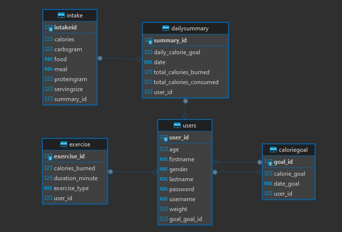
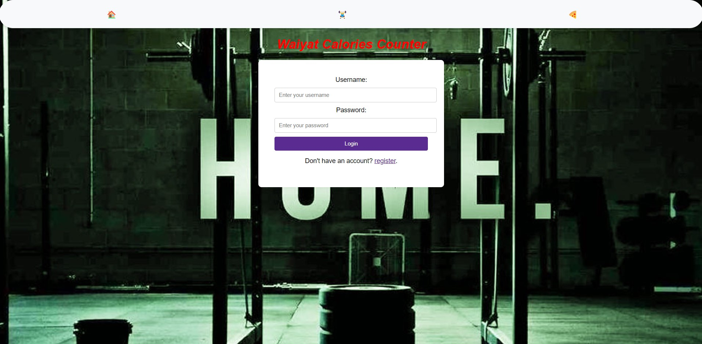
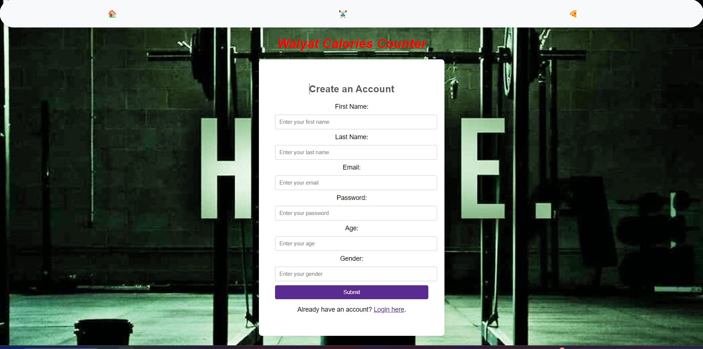

ERD

The Website 

#To start by build your own applciation properties for postgress
#url ,username , password
0)spring.application.name=WaiyatCaloriesCounter
1)spring.datasource.url=jdbc:postgresql://localhost:####/your_db_name
2)spring.datasource.username=pyour_username
3)spring.datasource.password=your_password

# Spring database stuff
4)spring.jpa.show-sql=true
5)spring.jpa.properties.hibernate.format_sql=true
6)spring.datasource.driverClassName=org.postgresql.Driver
7)spring.jpa.database-platform=org.hibernate.dialect.PostgreSQLDialect
8)spring.jpa.hibernate.ddl-auto=update
# other modes for ddl: create, validate, update, create-drop
9)Then you can start java server by running WaiyatCaloriesCounterApplication.java

for the Client : start your react application in visual studio code using bash terminal
1) first npm install after pulling
2) npm install react-router-dom
3) npm install axios
4) 
